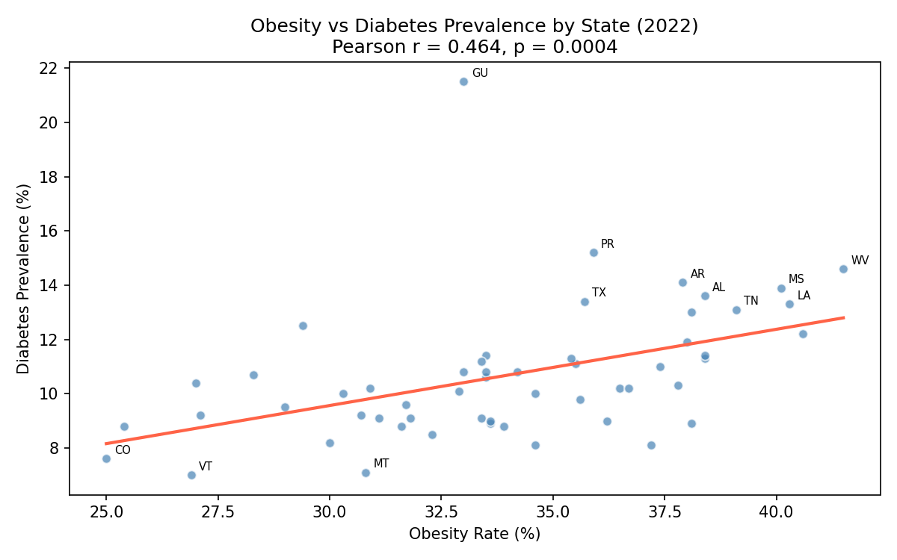
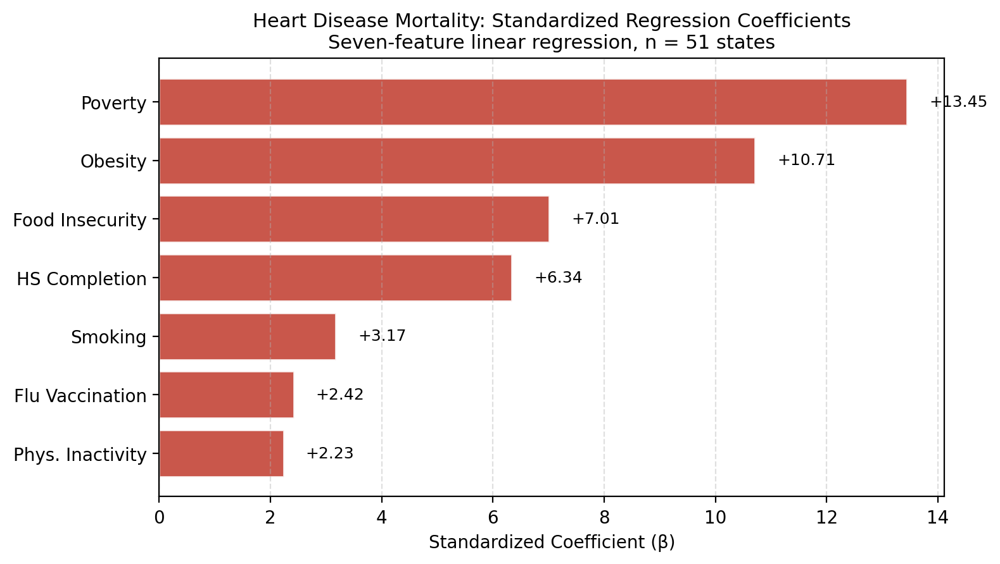
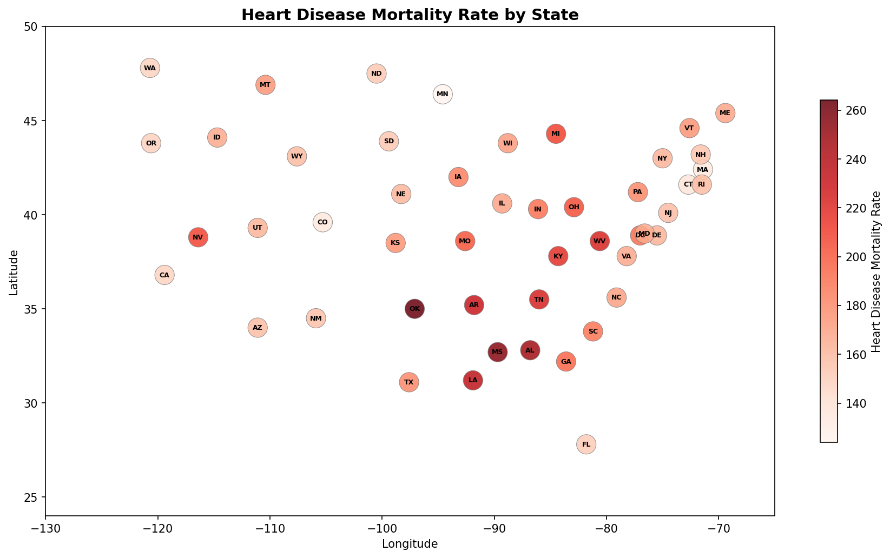
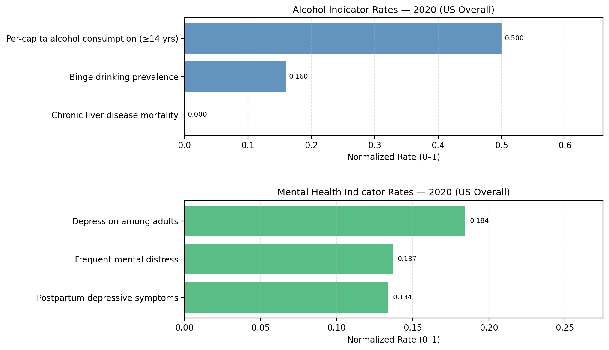

# Chronic Disease Indicators: Predicting State-Level Disease Rates from CDC Data

**DS2500: Team Project Final Report**

**Team Members:**

- Jonathan Chamberlin (chamberlin.j@northeastern.edu)
- Min Yu Huang (huang.minyu@northeastern.edu)
- Anuhya Mandava (mandava.an@northeastern.edu)
- Tsion Tekleab (tekleab.t@northeastern.edu)

**Section:** 1  
**Date:** April 21, 2026

---

## 1. Introduction

### Goal & Problem Statement

We set out to identify which health and lifestyle indicators best predict state-level rates of four major chronic disease groups: cardiovascular disease, diabetes, cancer with COPD, and mental health with alcohol use. Rates vary dramatically across U.S. states—Mississippi's heart disease mortality is nearly double Colorado's, and diabetes prevalence ranges from under 8 percent in Colorado to over 14 percent in West Virginia. Public health campaigns often treat these conditions as individual-behavior problems. Our question was whether the data supports that assumption, or whether something else explains the state-level gaps. State is the natural unit because that is where public health budgets are allocated.

### Why This Matters

Heart disease is the leading cause of death in the United States, and the four condition groups we studied together account for a majority of chronic-disease mortality and healthcare spending. If the strongest predictor of heart disease mortality at the state level is poverty rather than smoking, that changes which interventions state health departments should fund first. Identifying the shared driver also lets policy target the root rather than each disease separately.

---

## 2. Dataset

### Dataset Overview

- **Source:** U.S. Chronic Disease Indicators (CDI), data.cdc.gov, hosted on data.gov ([catalog.data.gov/dataset/u-s-chronic-disease-indicators](https://catalog.data.gov/dataset/u-s-chronic-disease-indicators))
- **Time Period:** 2015–2022
- **Size:** 309,216 records × 35 columns raw. After cleaning to one value per state per indicator, the working table is 51 rows (50 states + DC) × 27 indicators.
- **Format:** CSV

### Data Collection Methodology

CDI is the CDC's official chronic-disease tracking system, aggregating values from the Behavioral Risk Factor Surveillance System (BRFSS, a telephone survey of adults), the National Vital Statistics System (state death certificates), and the National Health Interview Survey. Each raw row is one indicator-value-year-state observation.

### Key Variables

| Variable | Description | Type | Example |
|---|---|---|---|
| LocationDesc | State or territory name | Categorical | "Mississippi" |
| Topic | Disease or risk-factor category | Categorical | "Cardiovascular Disease" |
| Question | Specific indicator measured | Categorical | "Mortality from heart failure" |
| DataValue | Indicator value for the state-year | Numeric | 280.4 |
| DataValueType | Rate format | Categorical | "Age-adjusted Prevalence" |
| Stratification1 | Demographic cut | Categorical | "Overall" |
| YearStart | Measurement year | Numeric | 2022 |

Our cardiovascular predictor set was seven indicators: adult smoking, obesity, physical inactivity, flu vaccination, poverty, food insecurity, and high school completion.

### Ethical Considerations

CDI is aggregated at the state level, so no individual records are published. The bias that mattered most is representational: BRFSS is a phone survey, so households without phones, unhoused people, and people in institutional settings are systematically underrepresented, which probably pushes our poverty-related signals downward. Insurance coverage and social support were missing for 16 of 51 states each, so we excluded insurance from the cross-disease model rather than impute. State-level analysis also carries ecological-fallacy risk: a state-level correlation between poverty and heart disease does not imply the same proportional risk for an individual in poverty, and we flag this throughout the results.

---

## 3. Methods

### Data Preprocessing

We filtered the raw CDI CSV to six topics (Cardiovascular Disease, Diabetes, Cancer, COPD, Alcohol, Mental Health), kept rows with a numeric `DataValue` and `Stratification1 = "Overall"` to avoid subgroup contamination, and dropped columns more than 50 percent null. We then pivoted to a state-by-indicator matrix at the latest available year per indicator (mostly 2022), preserving each indicator's native rate format.

### Exploratory Data Analysis

Early EDA surfaced two patterns that shaped the modeling. Heart disease mortality, poverty, obesity, and physical inactivity clustered geographically in the Southeast, and the correlation heatmap showed them moving together. Diabetes and obesity correlated at Pearson r = 0.464 (p = 0.0004; see Figure 1), but the cluster was weaker than for heart disease, suggesting diabetes had different drivers.

*Figure 1. Obesity rate vs. diabetes prevalence across U.S. states (2022). Pearson r = 0.464, p = 0.0004. The Southeast cluster (MS, LA, AL, WV, AR) sits in the upper right; Colorado and Vermont anchor the lower left.*

### Modeling & Evaluation

For each track we compared a linear regression (for coefficient interpretation) and a K-nearest-neighbors regression (for non-linear similarity between states). With only 51 observations, an 80/20 split would leave ~10 test states, so we used leave-one-out cross-validation (LOOCV) throughout. Features were standardized before KNN; we swept k ∈ {3, 5, 7, 9} and reported the best k by LOOCV R².

Cardiovascular was the only track with enough well-populated predictors for a full multi-feature model; diabetes used a single-predictor LOOCV regression on obesity, and cancer, COPD, alcohol, and mental-health used bivariate Pearson correlation against the strongest available CDI predictor. The cross-disease comparison in the Conclusions is therefore between a full seven-feature model for heart disease and bivariate evidence for the other tracks.

---

## 4. Results & Conclusions

### Finding 1: Poverty predicts heart disease more than smoking does

Our best cardiovascular model explains 65 percent of the state-level variation in heart disease mortality (KNN, k = 7, LOOCV R² = 0.65). The linear model came in at R² = 0.53, and the fact that both methods landed near the same story gave us confidence in the finding.

The single strongest predictor is poverty. Its standardized coefficient is roughly four times larger than smoking's in the full seven-feature model (see Figure 2), and states above the median poverty rate have significantly higher heart disease mortality than those below (p < 0.0001). This was unexpected: public-health messaging around heart disease is built around individual lifestyle, but at the state level the economic environment carries more weight. A two-feature partial model narrows the gap to 1.6× with poverty still dominant (R² = 0.628); the 4× gap is partly shared variance with food insecurity (r = 0.83) allocated to poverty.

*Figure 2. Standardized regression coefficients for the seven-feature linear model predicting state-level heart disease mortality (n = 51 states). Poverty is the largest coefficient (β = 13.45), roughly 4× smoking's (β = 3.17).*

### Finding 2: Obesity is the strongest single predictor of diabetes, but leaves most variation unexplained

Diabetes behaves differently from heart disease. Obesity is the strongest single predictor of diabetes prevalence that we tested, and poverty's effect shrinks sharply once obesity is in the model. Across states, obesity and diabetes prevalence correlate at r = 0.464 (p = 0.0004), and obesity alone explains 17 percent of the state-level variation in diabetes (LOOCV R²). That leaves 83 percent unexplained, so we read this as a ranking result rather than a causal story: obesity ranks higher than poverty for diabetes, but a well-specified diabetes model would need more predictors. The top of the ranking is different from heart disease, which is the cleanest evidence we have that the same CDC data points to different drivers for different diseases.

*Figure 3. State-level heart disease mortality, 2022. Each circle is a state positioned by longitude and latitude; darker shades indicate higher mortality per 100,000. The Southeast band (MS, LA, AL, WV, AR) sits at the top, mirroring the pattern in the diabetes-prevalence and poverty distributions.*

### Finding 3: Tobacco use correlates with cancer and COPD, but explains less than expected

For cancer and COPD we expected tobacco use to dominate. It correlates with both (r = 0.46 for cancer, r = 0.57 for COPD; see Figure 4, both p < 0.0001), but tobacco alone explains only 22 percent of variation in cancer prevalence and 32 percent in COPD prevalence—leaving two-thirds to three-quarters of the variation unaccounted for. Even for diseases with a well-known single-factor story, state-level outcomes appear shaped by inputs our current model does not capture (air quality, occupational exposure, healthcare access, screening rates).

*Figure 4. Tobacco use vs. cancer prevalence (left, r = 0.46, R² = 0.22) and vs. COPD prevalence (right, r = 0.57, R² = 0.32) across U.S. states pooled across 2019–2022, with linear trend lines.*

### Finding 4: Alcohol and mental-health outcomes track specific social indicators

For alcohol, per-capita consumption among people aged 14 and older was the strongest predictor of alcoholism outcomes (p = 0.0002)—a direct exposure measure that aligns with the clinical literature. For mental health, the strongest available predictor was postpartum depressive symptoms among women with a recent live birth (p = 0.0118). Because CDI's state-level mental-health coverage is sparse, we read the postpartum signal as a proxy for maternal-health infrastructure and social support rather than as a direct driver of adult depression rates.

*Figure 5. Normalized rates of alcohol (top) and mental-health (bottom) indicators for the United States, 2020. Percent indicators divided by 100; per-capita alcohol consumption divided by 5 gallons. Per-capita alcohol consumption is the dominant alcohol indicator; depression among adults is the largest mental-health indicator.*

### Conclusions

At the state level, the same CDC dataset points to different drivers for different chronic diseases. Heart disease is dominated by poverty, diabetes by obesity, cancer and COPD by a mix where tobacco is significant but insufficient, and alcohol and mental-health outcomes by specific upstream social indicators. A public health strategy built around "target individual behavior" fits diabetes reasonably well, fits cancer and COPD partially, and fits heart disease poorly. The Southeast appears at the top of almost every outcome we studied, and the shared factor in the heart-disease and diabetes rankings is poverty.

Individual behavior still matters, but at the state level the social and economic predictors carry more weight than public-health messaging suggests. A state health department trying to move heart disease numbers would likely get more return from poverty-adjacent policy (income support, Medicaid expansion, food assistance) than from another round of smoking-cessation campaigns.

---

## 5. Future Work & Limitations

### Limitations

With only 51 observations the dataset is small. LOOCV gives us every state as a test point but does not buy us statistical power; we did not compute bootstrap confidence intervals, so the 4× poverty-vs-smoking gap should be read as a ranking rather than a precise point estimate.

We selected k for KNN (sweeping 3, 5, 7, 9) on the same LOOCV loop used to report R², which is mild selection leakage and makes the headline R² = 0.65 slightly optimistic. The linear model's R² = 0.53 carries no such selection and is the conservative anchor.

Predictor collinearity is a third caveat. Poverty covaries with food insecurity (r = 0.83), smoking (r = 0.64), and obesity (r = 0.58) across states. Variance inflation factors put poverty at 5.13 (highest), food insecurity at 3.50, and obesity at 3.36, meaning the 4× gap in the full model is partly shared variance being allocated to poverty rather than a clean independent effect.

Our analysis is ecological: a state-level correlation does not establish individual-level risk. Insurance coverage and social support were missing for 16 states each, so we could not directly compare insurance against poverty. The CDI predictor set is also limited to what CDC publishes at the state level; drivers we suspect matter (air quality, occupational exposure, healthcare density) are absent or county-level only—clearest for cancer and COPD, where tobacco explains only a quarter of the variance. Values are mostly from 2022, so findings describe that snapshot most reliably.

### Future Research Directions

1. **County-level data.** CDI publishes some indicators at county granularity. Moving from n = 51 to n > 3,000 counties would give real statistical power and let us control for within-state variation.
2. **Broader predictor set.** Healthcare access (provider density, insurance with imputation), environmental exposure (air quality, industrial proximity), and demographic structure were absent from our set.
3. **Stroke gap.** Stroke mortality gave R² = 0.11 (linear) and 0.27 (KNN) on the same seven-feature pipeline—far below heart disease. A follow-up pulling in acute-care access variables (stroke-ready hospital density, time-to-tPA, EMS response) would test whether the gap is about care access rather than upstream social drivers.
4. **Policy deliverable.** For state health departments the right output is not a regression model but a ranked list of states by controllable risk factor with confidence intervals, turning the academic result into something a public health office could act on.

---

## References

Centers for Disease Control and Prevention. (2024). *U.S. Chronic Disease Indicators*. Data.CDC.gov. https://catalog.data.gov/dataset/u-s-chronic-disease-indicators

Centers for Disease Control and Prevention. (2024). *Behavioral Risk Factor Surveillance System Overview*. https://www.cdc.gov/brfss/about/index.htm

Hastie, T., Tibshirani, R., & Friedman, J. (2009). *The Elements of Statistical Learning* (2nd ed.). Springer.

Pedregosa, F., Varoquaux, G., Gramfort, A., et al. (2011). Scikit-learn: Machine learning in Python. *Journal of Machine Learning Research, 12*, 2825–2830.
